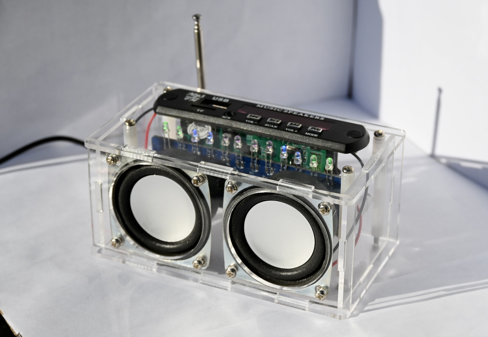
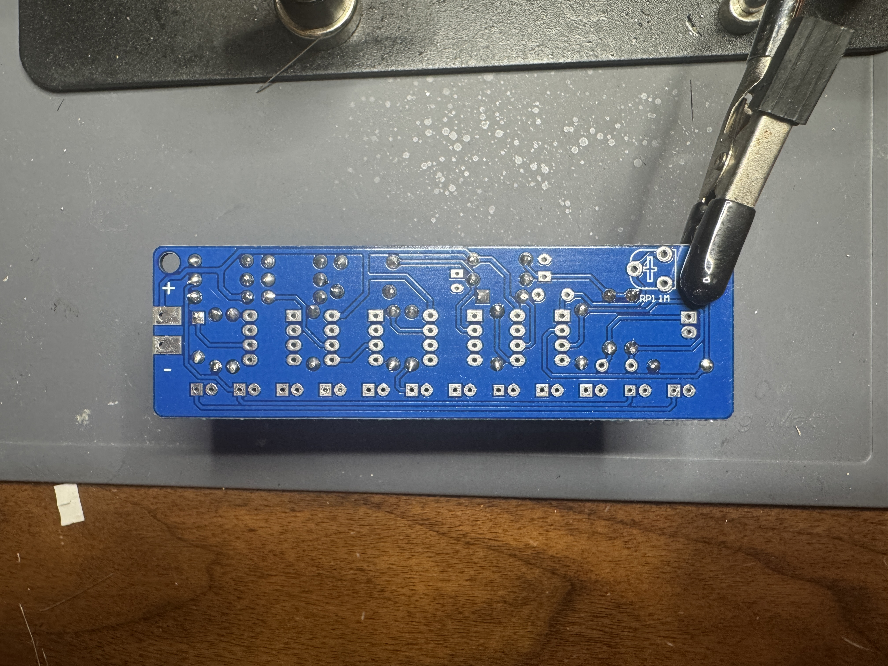
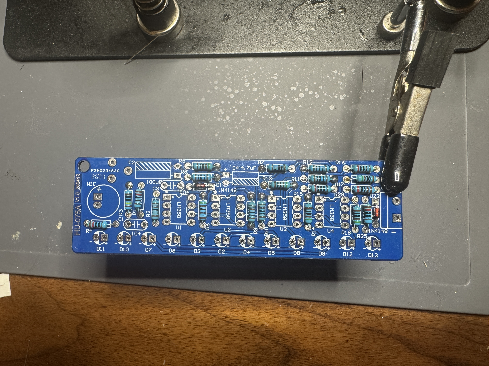
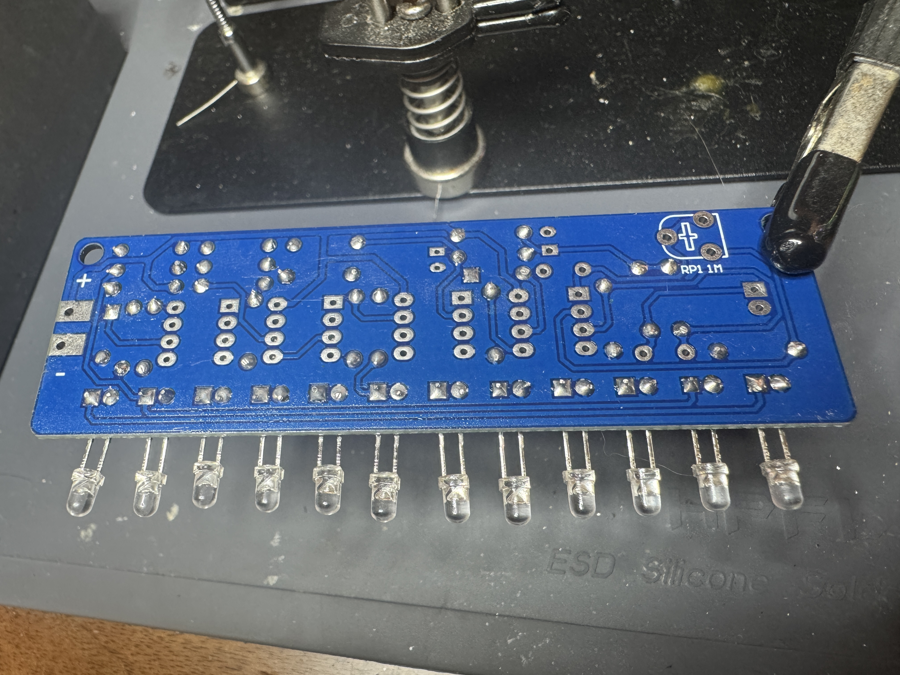
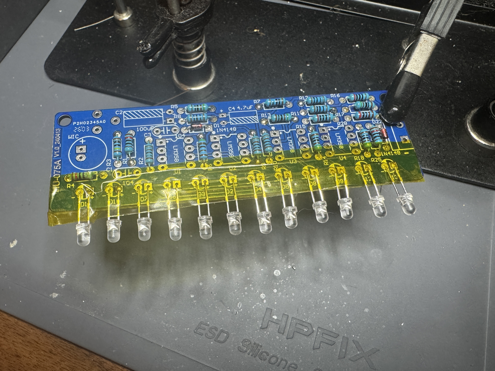
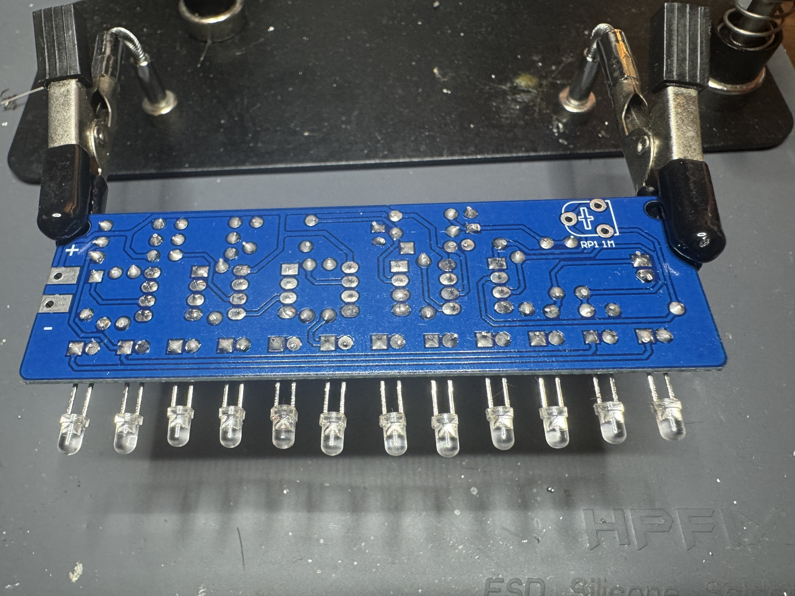
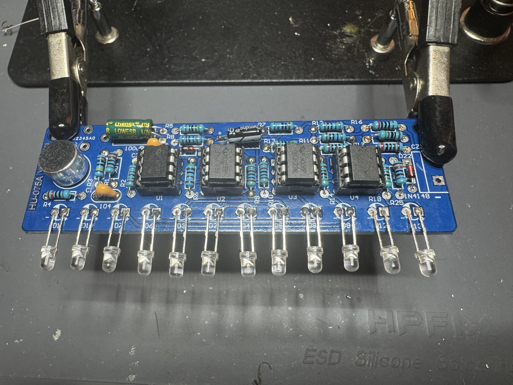

# BANRIA FM Radio + Bluetooth Speaker — Hand-Soldered Build

DIY Bluetooth speaker kit with FM radio, recording function, and LED spectrum visualizer. Built from a through-hole soldering practice kit.

https://github.com/user-attachments/assets/12604e78-049f-454c-9fcb-a891ff712c82

## Kit details
- **Kit:** BANRIA DIY Bluetooth Speaker Kit (FM radio soldering practice kit)
- **Build type:** through-hole hand soldering, ~130+ solder joints
- **Functions:** Bluetooth audio, FM radio (auto-scan + station memory), voice recording via onboard MIC, 12-color LED spectrum visualizer, TF card / AUX / USB playback, IR remote control
- **Output:** 3W stereo speakers
- **Key components soldered:** 4x LM358 op-amp ICs (DIP-8, socketed), 12x 3mm LEDs, 20x metal-film resistors, 1N4148 diodes, electrolytic + monolithic capacitors, 1Mohm potentiometer, electret microphone, DC-005 power socket, AUX jack, power switch
- **Tools used:**
- [ ] YIHUA 862BD+ Soldering and Rework Station
- [ ] MAIYUM 63-37 Rosin Core Solder Wire 0.8mm
- [ ] KL-533 Liquid Flux
- [ ] Thermaltronics TMT-TC-2 Tip Tinner
- [ ] TOWOT Solder Wick Braid
- [ ] Hakko CHP 0.787 in. Medium Cutter
- [ ] Hakko CHP PN-2007 Long Nose Pliers
- [ ] Magnetic Helping Hands
- [ ] ENGINEER Solder Sucker Professional Grade Aluminum Desoldering Pump SS-03 
- [ ] Isopropyl Alcohol
- [ ] ESD Brush

## Build photos

## Bill of materials
| #  | Component                  | PCB marker             | Spec         | Qty |
|----|----------------------------|------------------------|--------------|-----|
| 1  | LM358 IC                   | U1–U4                  | DIP-8        | 4   |
| 2  | IC socket                  | U1–U4                  | DIP-8        | 4   |
| 3  | 3mm pink LED               | D2–D5                  | 2-pin        | 4   |
| 4  | 3mm blue LED               | D6–D9                  | 2-pin        | 4   |
| 5  | 3mm green LED              | D10–D13                | 2-pin        | 4   |
| 6  | 1N4148 diode               | D1, D22                | DO-35        | 2   |
| 7  | Monolithic capacitor       | C1, C3                 | 0.1uF (104)  | 2   |
| 8  | Electrolytic capacitor     | C4                     | 4.7uF        | 1   |
| 9  | Electrolytic capacitor     | C2                     | 100uF        | 1   |
| 10 | Metal film resistor        | R7, R8, R11, R12       | 100 ohm      | 4   |
| 11 | Metal film resistor        | R15, R16               | 200 ohm      | 2   |
| 12 | Metal film resistor        | R5, R13, R14, R17, R18 | 510 ohm      | 5   |
| 13 | Metal film resistor        | R2, R9, R10            | 1K ohm       | 3   |
| 14 | Metal film resistor        | R28                    | 2K ohm       | 1   |
| 15 | Metal film resistor        | R6                     | 5.1K ohm     | 1   |
| 16 | Metal film resistor        | R1, R4, R25            | 10K ohm      | 3   |
| 17 | Metal film resistor        | R3                     | 1M ohm       | 1   |
| 18 | Potentiometer              | PR1                    | 1M ohm (105) | 1   |
| 19 | Electret microphone        | MIC                    | 9.7mm        | 1   |
| 20 | PH2.0-2P red/black wire    | —                      | 15cm         | 3   |
| 21 | Red/black speaker wire     | CZ                     | 10cm         | 1   |
| 22 | Red antenna wire           | —                      | 15cm         | 1   |
| 23 | Bluetooth receiver module  | —                      | preassembled | 1   |
| 24 | Infrared remote controller | —                      | —            | 1   |
| 25 | Speaker                    | —                      | 4 ohm, 3W    | 2   |
| 26 | FM antenna                 | —                      | —            | 1   |
| 27 | DC-005 power socket        | —                      | —            | 1   |
| 28 | Power switch (red/black)   | —                      | —            | 1   |
| 29 | USB to DC-005 power wire   | —                      | —            | 1   |
| 30 | AUX audio socket           | —                      | —            | 1   |
| 31 | AUX audio wire             | —                      | —            | 1   |
| 32 | Transparent acrylic panel  | —                      | —            | 6   |
| 33 | Nylon standoff             | —                      | M3 × 50mm    | 4   |
| 34 | Nylon standoff             | —                      | M3 × 28mm    | 2   |
| 35 | Screw                      | —                      | M3 × 12mm    | 4   |
| 36 | Screw                      | —                      | M3 × 8mm     | 18  |
| 37 | Nut                        | —                      | M3           | 10  |
| 38 | PCB                        | —                      | HU-075A      | 1   |

## Testing
- [ ] Powers on via USB-DC005
- [ ] FM radio: auto-scan finds stations, memory retains presets after power-off
- [ ] Bluetooth pairs and plays audio
- [ ] LED spectrum responds to audio
- [ ] Tested all operations of the FM module and made sure all mechanical buttons worked for the functions advertised

## Troubleshooting log
- [ ] Verified the resistors values using a DMM and adjusted the correct testing parameter to read the values
- [ ] Tested each ICs socket leg are connected on the under side of the PCB using continuity mode on my DMM
- [ ] Checked all my wire splices and joined wires, and add shrink tube in some areas to prevent a short with other components in the enclosure

## What I learned
- [ ] During my soldering assembly, I've learned with later solder points to be more generous with solder to make my solder points one step closer to perfect
- [ ] learned to use the mid area of the iron top to ensure maximum surface contact for better heat transfer
- [ ] learned to be caution with ICs when placing in their soldered ICs sockets and discharged myself using and ESD bracelet because ICs are extremely sensitive to electrostatic discharge
- [ ] learned to be observant when installing diodes or unilateral electronic devices, by looking for markings on the diodes and or seeing which leg was shorter like cathode side
